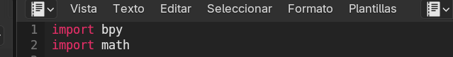
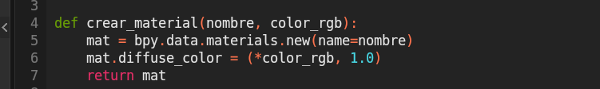
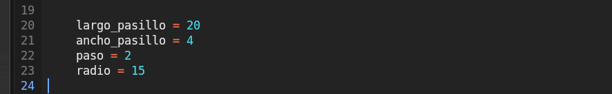
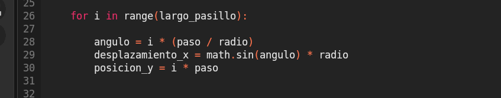
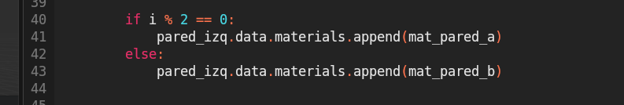
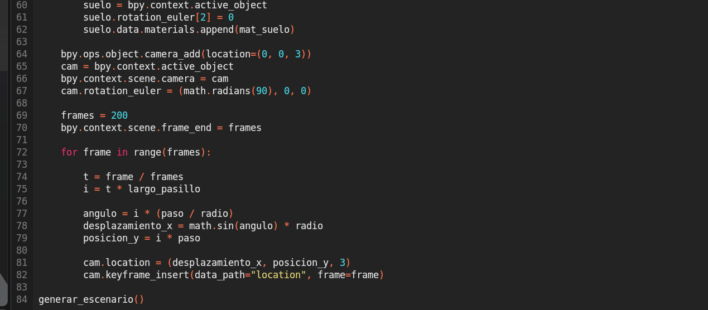
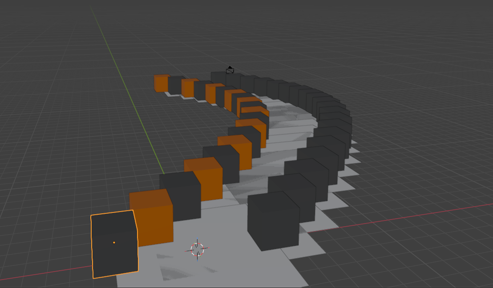

# U1-PROYECTO-INTEGRADOR
El proyecto esta basado en la tarea Escenario Procedural agregando la animación de la cámara a través del camino. 

# Índice

1. Introducción
2. Objetivo
3. Tecnologías Utilizadas
4. Desarrollo de la Práctica

   * 4.1 Preparación del Entorno
   * 4.2 Creación de Materiales
   * 4.3 Definición de Parámetros
   * 4.4 Generación del Pasillo Curvo
   * 4.5 Creación de la Cámara
   * 4.6 Animación del Recorrido
5. Resultados
6. Conclusión
7. Cómo Ejecutar el Proyecto

---

# 1. Introducción

En esta práctica se desarrolló un escenario tridimensional utilizando programación en Python dentro de Blender.

El proyecto consiste en la generación automática de un pasillo curvo compuesto por paredes y suelo, además de la animación de una cámara que simula un recorrido en primera persona.

El modelado no se realizó manualmente; todo el entorno fue construido mediante código utilizando la API `bpy`.

---

# 2. Objetivo

Diseñar un pasillo curvo en un entorno 3D y automatizar la animación de una cámara que recorra su trayectoria, aplicando principios de programación y funciones matemáticas.

---

# 3. Tecnologías Utilizadas

* Blender
* Python
* API `bpy`
* Librería matemática `math`

---

# 4. Desarrollo de la Práctica

## 4.1 Preparación del Entorno

Se importan las librerías necesarias:



Posteriormente, se limpia la escena eliminando los objetos existentes:

```python
bpy.ops.object.select_all(action='SELECT')
bpy.ops.object.delete()
```

Esto garantiza que el escenario se genere desde cero.

---

## 4.2 Creación de Materiales

Se define una función para crear materiales personalizados:



Se crean tres materiales:

* Pared oscura
* Pared con detalle rojo
* Suelo blanco

Estos materiales se aplican posteriormente a los objetos generados.

---

## 4.3 Definición de Parámetros

Se establecen variables que controlan la geometría del pasillo:



* `largo_pasillo`: cantidad de segmentos.
* `ancho_pasillo`: distancia entre paredes.
* `paso`: separación entre módulos.
* `radio`: controla la curvatura.

---

## 4.4 Generación del Pasillo Curvo

Se utiliza un ciclo `for` para crear cada segmento:
La curvatura se obtiene mediante una función trigonométrica:



El seno permite generar el desplazamiento lateral en el eje X, produciendo la curva del pasillo.

En cada iteración se crean:

* Pared izquierda (con alternancia de materiales).
* Pared derecha.
* Plano que representa el suelo.

La alternancia de materiales se realiza con:



Esto genera un efecto visual decorativo.

---

## 4.5 Creación de la Cámara

Se agrega una cámara en la escena:

```python
bpy.ops.object.camera_add(location=(0, 0, 3))
```

Se establece como cámara activa y se rota para que apunte hacia el frente del pasillo.

---

## 4.6 Animación del Recorrido

Se define la duración de la animación:

```python
frames = 200
bpy.context.scene.frame_end = frames
```

Luego se genera el movimiento de la cámara mediante keyframes:

```python
for frame in range(frames):
    cam.location = (desplazamiento_x, posicion_y, 3)
    cam.keyframe_insert(data_path="location", frame=frame)
```

Los keyframes permiten que Blender interpole el movimiento automáticamente entre cada cuadro.



---

# 5. Resultados

El script genera automáticamente:

* Un pasillo tridimensional curvo.
* Paredes con colores alternados.
* Piso continuo.
* Recorrido animado en primera persona.

La animación es fluida y se genera completamente mediante programación.




---

# 6. Conclusión

Esta práctica interactuamos mas con el software conocer mas su entorno o espacio de trabajo y mas que nada poder irnos relacionando con blender.

Se aplicaron conceptos de:

* Automatización mediante scripts.
* Geometría tridimensional.
* Trigonometría.
* Animación por keyframes.

El uso de programación permite optimizar tiempo y generar estructuras repetitivas de forma eficiente.

---

# 7. Cómo Ejecutar el Proyecto

1. Abrir Blender.
2. Ir a la pestaña **Scripting**.
3. Crear un nuevo archivo de texto.
4. Pegar el código completo.
5. Presionar **Run Script**.
6. Reproducir la animación en la línea de tiempo.

---

Si deseas, puedo agregarte también una sección de **mejoras futuras** para que tu repositorio se vea más profesional.
